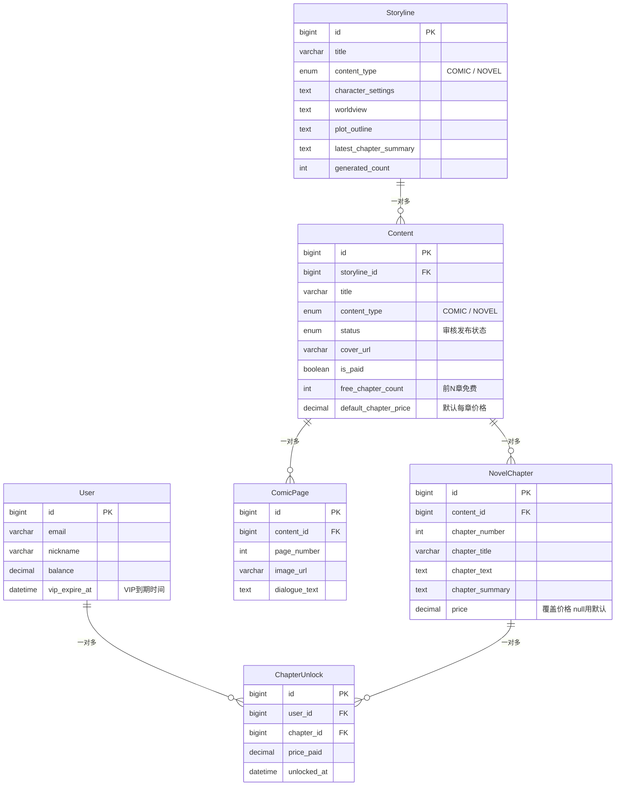
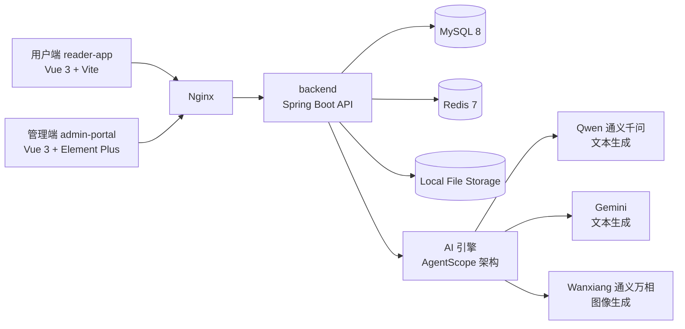
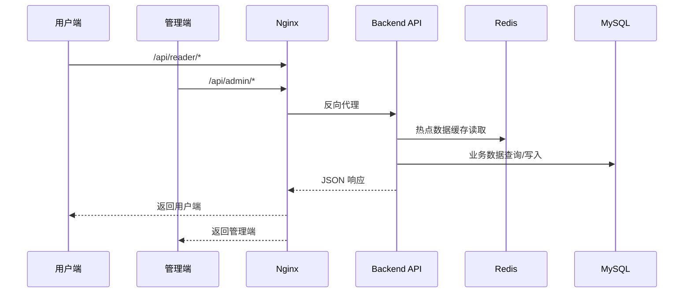
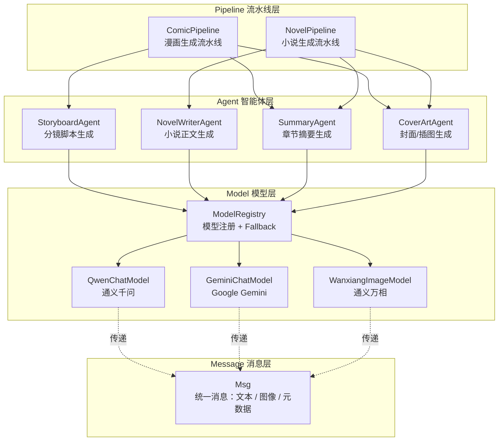
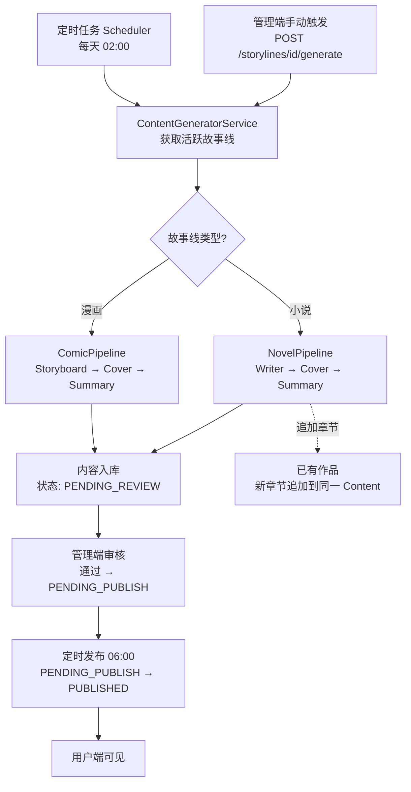
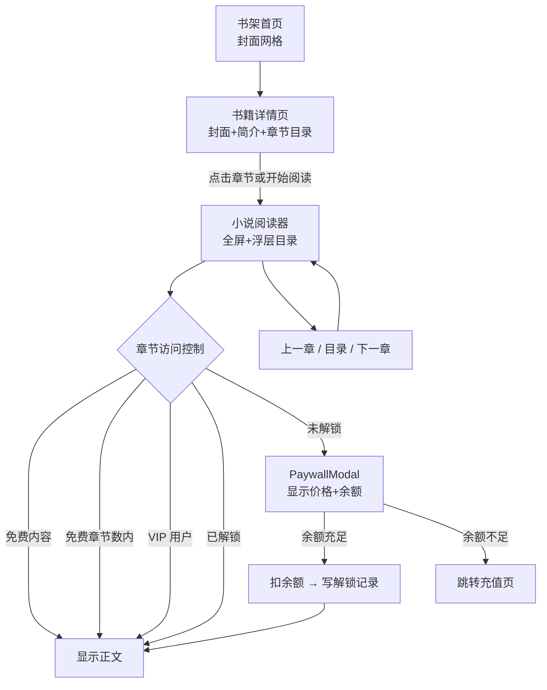

# ComicsAI - AI 漫画与小说阅读平台


一个面向内容消费场景的 AI 阅读平台，支持**自动生成、审核发布、前台阅读、按章付费、VIP 会员和运营分析**。  
项目由三个子系统组成：`reader-app`（用户端）、`admin-portal`（管理端）、`backend`（后端 API 与定时任务）。

> English: ComicsAI is an AI-powered reading platform for comics and novels, covering generation, moderation, publishing, per-chapter monetization, VIP access, and analytics in one workflow.

## 效果展示

### 用户端（Reader App）


### 管理端（Admin Portal）


## 目录

- [效果展示](#效果展示)
- [功能亮点](#功能亮点)
- [技术栈](#技术栈)
- [数据模型](#数据模型)
- [项目结构](#项目结构)
- [架构图](#架构图)
- [快速开始](#快速开始)
- [常用脚本](#常用脚本)
- [API 路由约定](#api-路由约定)
- [生产部署（简版）](#生产部署简版)
- [文档](#文档)
- [许可证](#许可证)

## 功能亮点

### 用户端（Reader App）
- **书架首页**：封面网格展示，分类筛选（全部/漫画/小说）、关键词搜索、无限滚动加载
- **书籍详情页**：封面+简介+章节目录（正序/倒序），显示"前N章免费"提示和付费/免费标识
- **沉浸式阅读器**：点击屏幕中间区域隐藏/显示顶栏与底栏，实现无干扰沉浸阅读
- **阅读设置面板**（底部滑出式抽屉，小说/漫画共享设置）
  - 🌿 **护眼模式 & 多主题**：默认白 / 护眼绿 / 纸纹黄 / 夜间黑，一键切换，带平滑过渡动画
  - 🔤 **字体大小调整**：14px ~ 28px 逐步增减（小说）
  - 🖋️ **字体选择**：系统字体、衬线、宋体、楷体、黑体 5 种（小说）
  - 📏 **行距调节**：紧凑 / 适中 / 宽松 / 超大 4 档（小说）
  - 🔆 **亮度调节**：40% ~ 100% 滑块控制，通过暗色遮罩实现
  - 📜 **自动滚动**：开关式，支持 5 档速度（小说）
  - 🔄 **恢复默认**：一键重置所有阅读设置
- **阅读进度条**：顶部蓝色细线进度条，实时显示章节/页面进度
- **章节字数统计**：底部显示当前章节约 xxx 字（小说）
- **漫画点击翻页**：屏幕左侧 30% 上一页、右侧 30% 下一页、中间切换工具栏
- **按章付费**：付费章节显示锁定提示和价格，点击弹出 PaywallModal 解锁
- **VIP 免费阅读**：VIP 用户自动获得所有付费章节的访问权限
- 用户注册、登录、个人中心、余额充值
- 阅读进度记忆（localStorage 持久化）
- 阅读设置持久化（主题/字体/行距/亮度等，跨会话保持）
- 阅读行为上报（浏览事件与时长）

### 管理端（Admin Portal）
- 故事线管理（创建、编辑、状态切换、生成配置、手动触发生成）
- 内容管理（编辑、审核、上下架、批量操作）
- **按章付费设置**：作品级付费开关、免费章节数、默认每章价格、单章自定义定价
- 数据看板（使用分析、Token 成本、充值统计、存储健康）

### 后端（Backend）
- **AgentScope 分层架构**：Message → Model → Agent → Pipeline，清晰解耦 AI 能力
- 多模型支持：Qwen（通义千问）、Gemini（Google）文本生成，Wanxiang（通义万相）图像生成
- ModelRegistry 统一管理模型实例，支持主模型失败自动 Fallback
- 两条生成流水线：`ComicPipeline`（漫画）与 `NovelPipeline`（小说）
- **小说连续章节生成**：同一故事线多次触发生成，章节自动追加到同一作品下，支持前章摘要衔接
- **章节级访问控制**：5 层判断（免费内容→免费章节数内→VIP→已解锁→拒绝），不可读章节正文返回 null
- **章节解锁**：扣余额、写解锁记录，支持单章价格覆盖和作品默认价格
- 定时内容生成（每天 `02:00`）+ 定时内容发布（每天 `06:00`）
- Redis 缓存热门内容，降低数据库查询压力
- Flyway 管理数据库迁移（V1 基础表 → V2 管理员+OAuth → V3 章节付费+VIP）

## 技术栈

| 模块 | 技术 |
|---|---|
| 后端 | Java 17, Spring Boot 3.2, MyBatis-Plus, Flyway |
| AI 架构 | AgentScope 分层设计（Msg / ChatModel / ImageModel / Agent / Pipeline） |
| AI 模型 | 阿里通义千问 (Qwen)、Google Gemini、阿里通义万相 (Wanxiang) |
| 前端（用户端） | Vue 3, TypeScript, Vite, Pinia, Vue Router, Axios |
| 前端（管理端） | Vue 3, TypeScript, Vite, Element Plus, Pinia |
| 数据存储 | MySQL 8, Redis 7, 本地文件存储 |
| 测试 | JUnit 5, jqwik, Vitest |
| 部署 | Nginx（可选） |

## 数据模型



## 项目结构

```text
.
├── backend/                          # Spring Boot API + 定时任务 + 数据访问
│   └── src/main/java/com/comicsai/
│       ├── ai/                       # AI 分层架构（AgentScope 设计）
│       │   ├── message/              #   Msg — 统一消息类型
│       │   ├── model/                #   ChatModel / ImageModel / ModelRegistry
│       │   │   ├── qwen/             #   通义千问 + 通义万相
│       │   │   └── gemini/           #   Google Gemini
│       │   ├── agent/                #   StoryboardAgent / NovelWriterAgent / CoverArtAgent / SummaryAgent
│       │   ├── pipeline/             #   ComicPipeline / NovelPipeline
│       │   └── config/               #   AiProperties + AiConfiguration
│       ├── controller/               # REST API（reader / admin）
│       ├── service/                  # 业务逻辑（ContentService 含章节访问控制）
│       ├── model/
│       │   ├── entity/               # Content / NovelChapter / ChapterUnlock / User ...
│       │   ├── dto/                  # PaidDTO / ChapterPriceDTO ...
│       │   └── vo/                   # ContentDetailVO / NovelChapterVO ...
│       ├── mapper/                   # MyBatis-Plus Mapper
│       ├── scheduler/                # 定时任务（生成 + 发布）
│       └── config/                   # Spring 配置（JWT / CORS / 资源）
├── reader-app/                       # 用户端（Vue 3）
│   └── src/
│       ├── views/
│       │   ├── HomePage.vue          #   书架首页
│       │   ├── ContentDetail.vue     #   书籍详情页（封面+目录+付费标识）
│       │   ├── NovelReader.vue       #   小说阅读器（沉浸式+设置面板+自动滚动）
│       │   └── ComicReader.vue       #   漫画阅读器（沉浸式+点击翻页+主题）
│       ├── components/
│       │   ├── ContentCard.vue       #   书架卡片
│       │   ├── PaywallModal.vue      #   付费解锁弹窗（支持章节级/内容级）
│       │   └── ReaderSettingsPanel.vue #  阅读设置面板（亮度/字号/主题/行距/字体）
│       └── composables/
│           └── useReaderSettings.ts  #   阅读设置状态管理（主题/字体/持久化）
├── admin-portal/                     # 管理端（Vue 3 + Element Plus）
│   └── src/views/
│       ├── ContentReview.vue         #   内容审核（含章节定价编辑）
│       └── ContentManage.vue         #   内容管理（含付费设置扩展）
├── nginx.conf                        # 反向代理示例配置
└── QUICK_START.md                    # 更详细的启动与排障说明
```

## 架构图

### 1) 系统总览



### 2) 请求链路



### 3) AI 分层架构（AgentScope 设计）



### 4) 内容生产与发布链路



### 5) 用户阅读与付费链路



## 快速开始

> 目标：本地启动完整开发环境（后端 + 用户端 + 管理端）

### 1) 环境准备

- Java 17+
- Maven 3.8+
- Node.js 18+
- MySQL 8.0+
- Redis 7+

### 2) 初始化数据库

```sql
CREATE DATABASE comics_ai CHARACTER SET utf8mb4 COLLATE utf8mb4_unicode_ci;
```

### 3) 启动后端（`backend`）

1. 修改 `backend/src/main/resources/application.yml` 的数据库/Redis连接信息。
2. 启动：

```bash
cd backend
mvn spring-boot:run
```

后端默认地址：`http://localhost:8080`

### 4) 启动用户端（`reader-app`）

```bash
cd reader-app
npm install
npm run dev
```

默认访问地址：`http://localhost:5173`

### 5) 启动管理端（`admin-portal`）

```bash
cd admin-portal
npm install
npm run dev
```

默认访问地址：`http://localhost:5174`

### 6) 生成小说章节

1. 在管理端创建一个**小说类型**的故事线（设定角色、世界观、剧情大纲）
2. 配置生成参数（文本模型、图像模型等）
3. 点击"生成"或调用 `POST /api/admin/storylines/{id}/generate`
4. 每次触发生成都会自动追加下一章到同一作品
5. 在管理端审核通过后，用户端即可阅读

## 常用脚本

### Backend

```bash
cd backend
mvn test
mvn clean package -DskipTests
```

### Reader App

```bash
cd reader-app
npm run dev
npm run build
npm run test
```

### Admin Portal

```bash
cd admin-portal
npm run dev
npm run build
```

## API 路由约定

- 用户端接口前缀：`/api/reader`
- 管理端接口前缀：`/api/admin`

### 关键接口

| 接口 | 说明 |
|---|---|
| `GET /api/reader/contents/{id}` | 内容详情（含章节访问控制） |
| `POST /api/reader/contents/chapters/{chapterId}/unlock` | 章节解锁 |
| `POST /api/admin/storylines/{id}/generate` | 触发内容生成（追加章节） |
| `PUT /api/admin/contents/{id}/paid` | 设置付费（含免费章节数、默认章节价格） |
| `PUT /api/admin/contents/chapters/{chapterId}/price` | 单章定价 |

## 生产部署（简版）

1. 分别构建 `reader-app` 与 `admin-portal`；
2. 启动后端 JAR 包；
3. 使用根目录 `nginx.conf` 统一代理静态资源与 API；
4. 确保 `uploads` 目录具备可写权限。

## 文档

- 详细启动说明与常见问题：[`QUICK_START.md`](./QUICK_START.md)
- AI 对接与首条内容生成闭环：[`QUICK_START.md#5-ai-对接与首条内容生成必做`](./QUICK_START.md#5-ai-%E5%AF%B9%E6%8E%A5%E4%B8%8E%E9%A6%96%E6%9D%A1%E5%86%85%E5%AE%B9%E7%94%9F%E6%88%90%E5%BF%85%E5%81%9A)

## 许可证

当前仓库未包含许可证文件，如需开源发布，建议补充 `LICENSE`。
