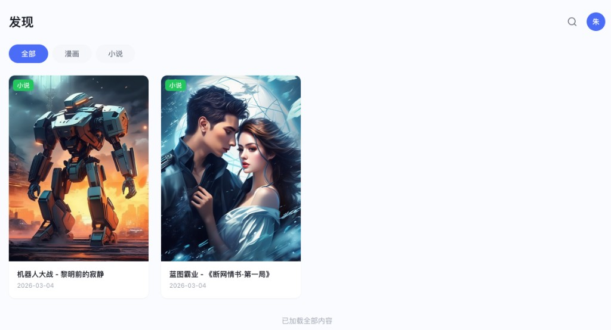
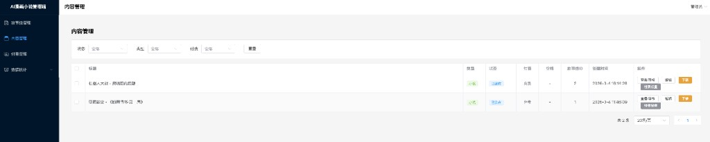
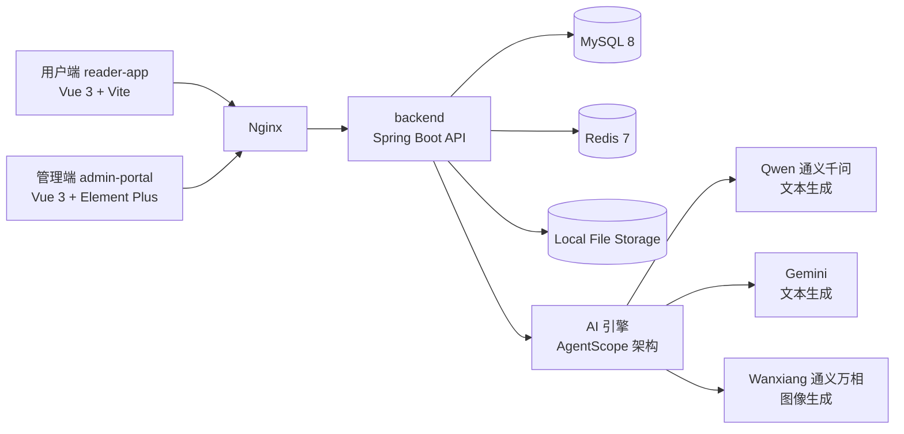
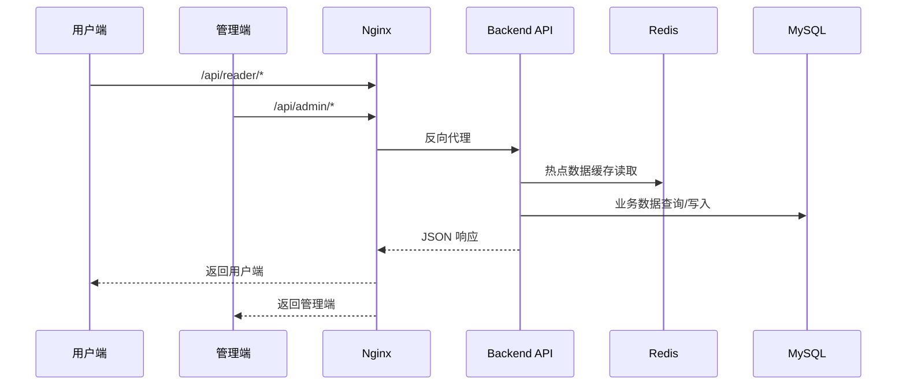
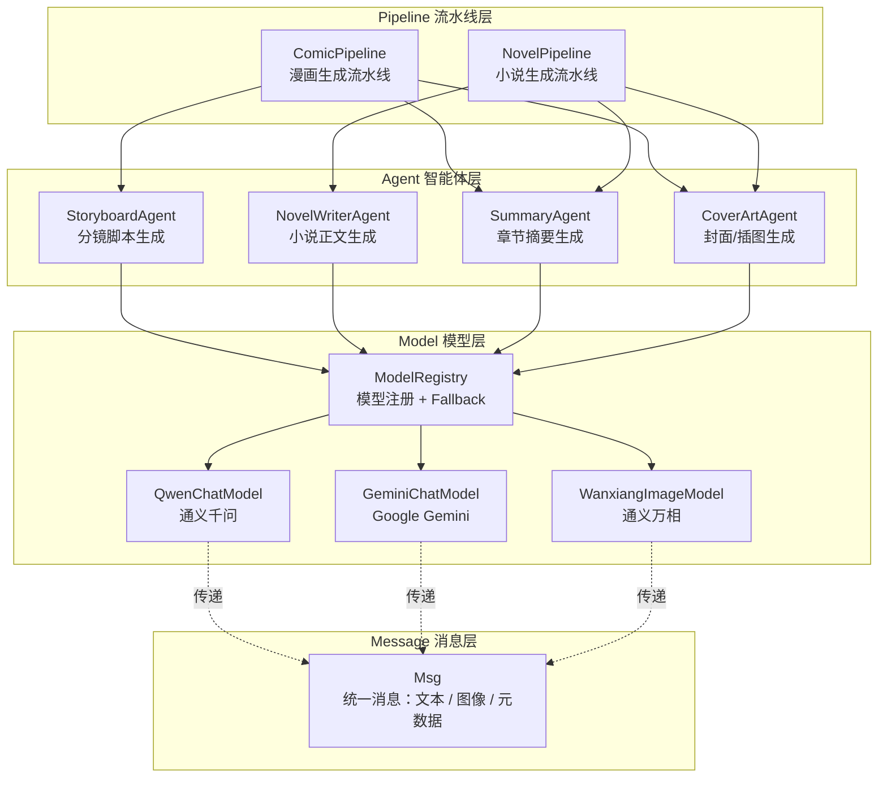
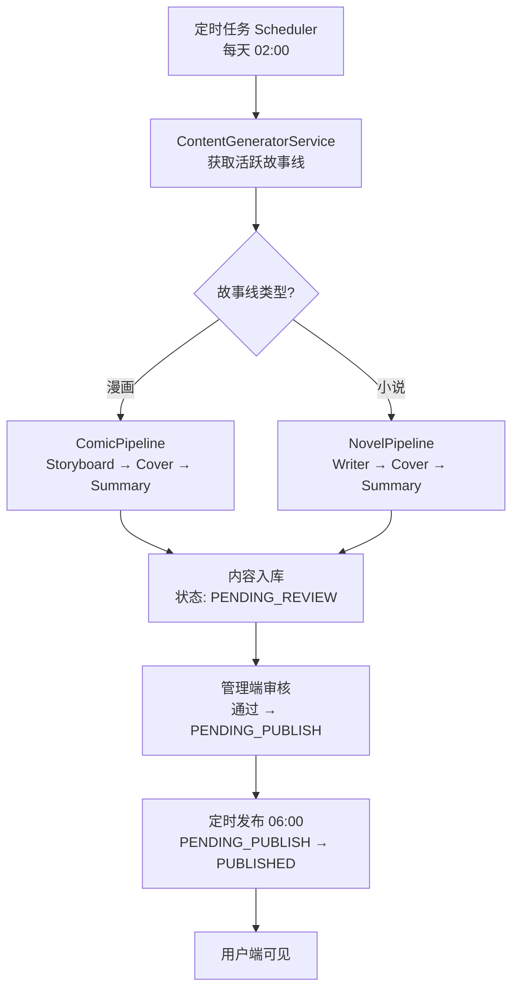

# ComicsAI - AI 漫画与小说阅读平台


一个面向内容消费场景的 AI 阅读平台，支持**自动生成、审核发布、前台阅读、付费解锁和运营分析**。  
项目由三个子系统组成：`reader-app`（用户端）、`admin-portal`（管理端）、`backend`（后端 API 与定时任务）。

> English: ComicsAI is an AI-powered reading platform for comics and novels, covering generation, moderation, publishing, monetization, and analytics in one workflow.

## 效果展示

### 用户端（Reader App）



### 管理端（Admin Portal）



## 目录

- [效果展示](#效果展示)
- [功能亮点](#功能亮点)
- [技术栈](#技术栈)
- [项目结构](#项目结构)
- [架构图](#架构图)
- [快速开始](#快速开始)
- [常用脚本](#常用脚本)
- [API 路由约定](#api-路由约定)
- [生产部署（简版）](#生产部署简版)
- [文档](#文档)
- [许可证](#许可证)

## 功能亮点

### 用户端（Reader App）
- 漫画 / 小说内容浏览与详情阅读
- 分类筛选、关键词搜索、分页加载
- 用户注册、登录、退出、个人中心
- 余额充值与付费内容解锁
- 阅读行为上报（浏览事件与时长）

### 管理端（Admin Portal）
- 故事线管理（创建、编辑、状态切换、生成配置）
- 内容管理（编辑、审核、上下架、批量操作）
- 付费策略管理（单条/批量设置）
- 数据看板（使用分析、Token 成本、充值统计、存储健康）

### 后端（Backend）
- **AgentScope 分层架构**：Message → Model → Agent → Pipeline，清晰解耦 AI 能力
- 多模型支持：Qwen（通义千问）、Gemini（Google）文本生成，Wanxiang（通义万相）图像生成
- ModelRegistry 统一管理模型实例，支持主模型失败自动 Fallback
- 两条生成流水线：`ComicPipeline`（漫画）与 `NovelPipeline`（小说）
- 定时内容生成（每天 `02:00`）+ 定时内容发布（每天 `06:00`）
- Redis 缓存热门内容，降低数据库查询压力
- Flyway 管理数据库迁移

## 技术栈

| 模块 | 技术 |
|---|---|
| 后端 | Java 17, Spring Boot 3.2, MyBatis-Plus, Flyway |
| AI 架构 | AgentScope 分层设计（Msg / ChatModel / ImageModel / Agent / Pipeline） |
| AI 模型 | 阿里通义千问 (Qwen)、Google Gemini、阿里通义万相 (Wanxiang) |
| 前端（用户端） | Vue 3, TypeScript, Vite, Pinia, Vue Router, Axios |
| 前端（管理端） | Vue 3, TypeScript, Vite, Element Plus, Pinia |
| 数据存储 | MySQL 8, Redis 7, 本地文件存储 |
| 测试 | JUnit 5, jqwik, Vitest |
| 部署 | Nginx（可选） |

## 项目结构

```text
.
├── backend/                          # Spring Boot API + 定时任务 + 数据访问
│   └── src/main/java/com/comicsai/
│       ├── ai/                       # ✨ AI 分层架构（AgentScope 设计）
│       │   ├── message/              #   Msg — 统一消息类型
│       │   ├── model/                #   ChatModel / ImageModel / ModelRegistry
│       │   │   ├── qwen/             #   通义千问 + 通义万相
│       │   │   └── gemini/           #   Google Gemini
│       │   ├── agent/                #   StoryboardAgent / NovelWriterAgent / CoverArtAgent / SummaryAgent
│       │   ├── pipeline/             #   ComicPipeline / NovelPipeline
│       │   └── config/               #   AiProperties + AiConfiguration
│       ├── controller/               # REST API（reader / admin）
│       ├── service/                  # 业务逻辑
│       ├── scheduler/                # 定时任务（生成 + 发布）
│       └── config/                   # Spring 配置（JWT / CORS / 资源）
├── reader-app/                       # 用户端（Vue 3）
├── admin-portal/                     # 管理端（Vue 3 + Element Plus）
├── nginx.conf                        # 反向代理示例配置
└── QUICK_START.md                    # 更详细的启动与排障说明
```

## 架构图

> 下方图中的节点均可点击，跳转到对应目录或关键文件。

### 1) 系统总览（可点击）



### 2) 请求链路（可点击）



> 关键入口：[`reader-app/src`](./reader-app/src) · [`admin-portal/src`](./admin-portal/src) · [`backend/src/main/java/com/comicsai/controller`](./backend/src/main/java/com/comicsai/controller)

### 3) AI 分层架构（AgentScope 设计）



### 4) 内容生产与发布链路（可点击）



## 快速开始

> 目标：本地启动完整开发环境（后端 + 用户端 + 管理端）

### 1) 环境准备

- Java 17+
- Maven 3.8+
- Node.js 18+
- MySQL 8.0+
- Redis 7+

### 2) 初始化数据库

```sql
CREATE DATABASE comics_ai CHARACTER SET utf8mb4 COLLATE utf8mb4_unicode_ci;
```

### 3) 启动后端（`backend`）

1. 修改 `backend/src/main/resources/application.yml` 的数据库/Redis连接信息。
2. 启动：

```bash
cd backend
mvn spring-boot:run
```

后端默认地址：`http://localhost:8080`

### 4) 启动用户端（`reader-app`）

```bash
cd reader-app
npm install
npm run dev
```

默认访问地址：`http://localhost:5173`

### 5) 启动管理端（`admin-portal`）

```bash
cd admin-portal
npm install
npm run dev
```

默认访问地址：`http://localhost:5174`

## 常用脚本

### Backend

```bash
cd backend
mvn test
mvn clean package -DskipTests
```

### Reader App

```bash
cd reader-app
npm run dev
npm run build
npm run test
```

### Admin Portal

```bash
cd admin-portal
npm run dev
npm run build
```

## API 路由约定

- 用户端接口前缀：`/api/reader`
- 管理端接口前缀：`/api/admin`

## 生产部署（简版）

1. 分别构建 `reader-app` 与 `admin-portal`；
2. 启动后端 JAR 包；
3. 使用根目录 `nginx.conf` 统一代理静态资源与 API；
4. 确保 `uploads` 目录具备可写权限。

## 文档

- 详细启动说明与常见问题：[`QUICK_START.md`](./QUICK_START.md)
- AI 对接与首条内容生成闭环：[`QUICK_START.md#5-ai-对接与首条内容生成必做`](./QUICK_START.md#5-ai-%E5%AF%B9%E6%8E%A5%E4%B8%8E%E9%A6%96%E6%9D%A1%E5%86%85%E5%AE%B9%E7%94%9F%E6%88%90%E5%BF%85%E5%81%9A)

## 许可证

当前仓库未包含许可证文件，如需开源发布，建议补充 `LICENSE`。
